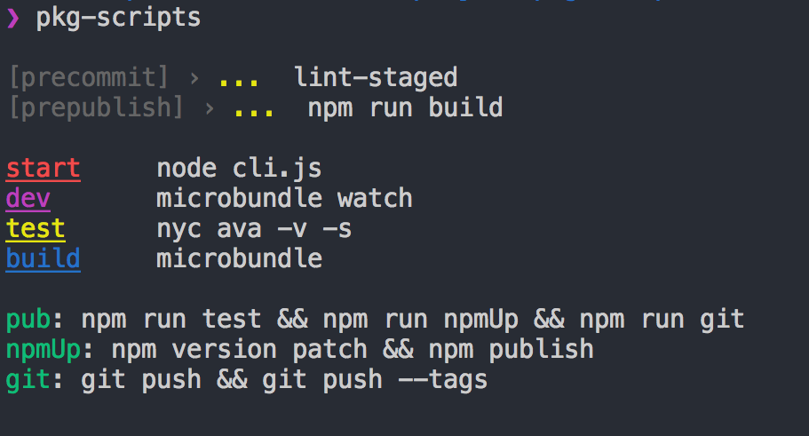

# pkg-scripts [](https://travis-ci.org/chinanf-boy/pkg-scripts) [](https://codecov.io/gh/chinanf-boy/pkg-scripts?branch=master)

> cli to show package.json scripts

[中文](./readme.md) | ~~[english](./readme.en.md)~~

## Install

```
npm i -g pkg-scripts
```

``` bash
pkg-scripts
```



## Usage

```js
const pkgScripts = require('pkg-scripts');
//=> just return package.json scripts

await pkgScripts(); // Promise
pkgScripts.sync(); // sync

```


## API

### pkgScripts

 name: | pkgScripts
---------|----------
Type: | `function:Promise`
Desc: | return package.json scripts

#### sync

 name: | sync
---------|----------
Type: | `function`
Desc: | return package.json scripts

### return

 name: | return
---------|----------
Type: | `Object`
Desc: | package.json scripts

---

## Use

- [pkg-conf](https://github.com/sindresorhus/pkg-conf)
- [signale](https://github.com/klauscfhq/signale)

<a href="https://patreon.com/yobrave">

</a>

## License

MIT © [chinanf-boy](http://llever.com)
